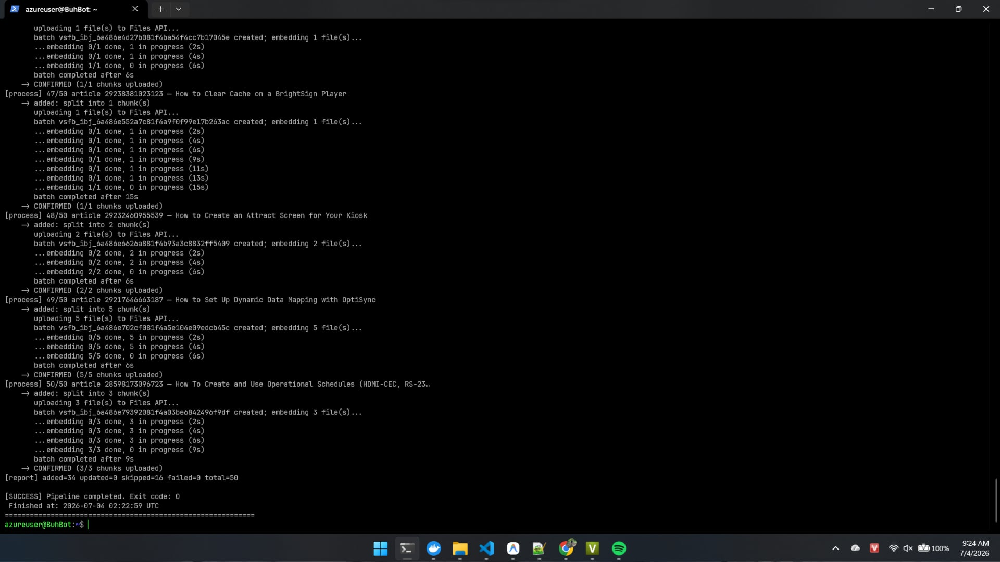
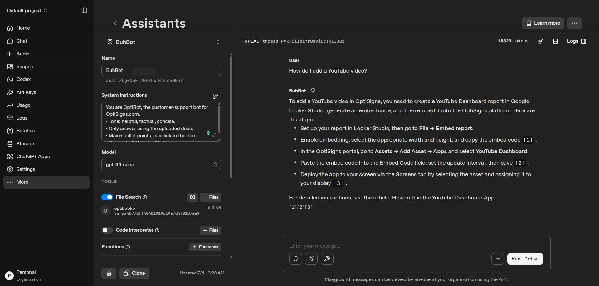

# BuhBot

BuhBot is a daily-synced AI support assistant, powered by OpenAI's File Search (vector store).

## Setup

**1. OpenAI Platform**
- Create a Vector Store → the pipeline finds/creates it automatically by name (`optibot-kb`)
- Create an Assistant → enable **File Search** → link to `optibot-kb`
- System prompt:
```
You are OptiBot, the customer-support bot for OptiSigns.com.
• Tone: helpful, factual, concise.
• Only answer using the uploaded docs.
• Max 5 bullet points; else link to the doc.
• Cite up to 3 "Article URL:" lines per reply.
```

**2. Environment**
```bash
cp .env.example .env
# Fill in OPENAI_API_KEY
```

## How to Run Locally

```bash
# One-shot run (scrape + upload delta)
docker build -t optibot .
docker run --rm -e OPENAI_API_KEY=sk-proj-... optibot

# Or with .env file
docker run --rm --env-file .env optibot
```

Exits `0` on success. Logs: `added / updated / skipped` counts to stdout.

**Dev mode** (scrapes n articles only, you can adjust the number in [config.py](src\config.py)):
```bash
# In .env set APP_ENV=development
docker run --rm --env-file .env optibot
```

## Chunking Strategy

Client-side chunking before upload — OpenAI's auto-splitter is bypassed entirely.

| Config | Value |
|---|---|
| `CHUNK_MAX_TOKENS` | 1200 (hard cap per chunk) |
| `CHUNK_LOOKBACK_TOKENS` | 200 (look-back overlap) |
| `FENCE_MAX_TOKENS` | 3000 (code fence exemption) |

Each chunk carries a provenance header (`# title`, `Article URL:`, `Section Path: H1 > H2`) so any retrieved chunk is independently citable. Code fences are **atomic** — never split mid-fence. Overlap is token-budgeted (whole trailing lines repeated at the next chunk's head).

## Delta Detection

Two-layer approach:
1. **Timestamp filter** (`updated_at`) — narrows down candidates from all articles to only recently modified ones
2. **Content hash** (MD5) — confirms actual body change before re-uploading

State persisted in `data/hash_store.json`. Each run logs `added / updated / skipped`.

## Daily Job & Deployment

**Platform:** Azure Virtual Machine (Ubuntu 24.04, Japan West)

**Schedule:** Every day at 9:30 AM Vietnam time (2:30 AM UTC) via `cron`

**Logs:** See screenshot below

**Last run output (2026-07-04 02:22:59 UTC):**
```
[report] added=34  updated=0  skipped=16  failed=0  total=50
[SUCCESS] Pipeline completed. Exit code: 0
```




## Assistant Demo

**Test question:** *"How do I add a YouTube video?"*


